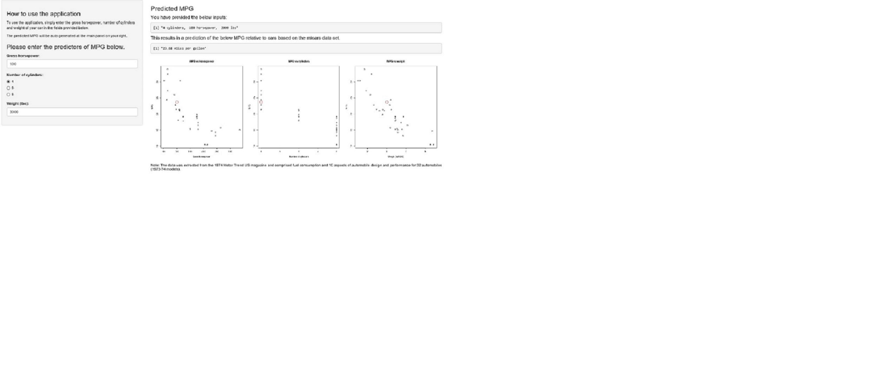

## Overview of the Project

The objective for this shiny application is to provide users with a prediction of the MPG relative to cars based on the mtcars dataset. Users simply need to enter the gross horsepower, number of cylinders and weight of the cars on the side panel. The result will be displayed automatically on the main panel.

The data was based on the 1974 Motor Trend US magazine and comprised fuel consumption and 10 aspects of automobile design and performance for 32 automobiles (1973-74 models).


```r
library(datasets)
head(mtcars, 3)
```

```
##                mpg cyl disp  hp drat    wt  qsec vs am gear carb
## Mazda RX4     21.0   6  160 110 3.90 2.620 16.46  0  1    4    4
## Mazda RX4 Wag 21.0   6  160 110 3.90 2.875 17.02  0  1    4    4
## Datsun 710    22.8   4  108  93 3.85 2.320 18.61  1  1    4    1
```

--- .class #id

## Data Organisation

The data was filtered from the original data set to extract the relevant variables. The variables selected for this application consisted of:

- Gross Horsepower (hp)
- Number of Cylinders (cyl)
- Weight (wt)

For each data grouping, the following information was graphed through Box Plot. These plots and the predictive MPG will be displayed automatically on the main panel when the relevant information have been entered on the side panel.

--- .class #id 

## Screenshot of the Application



--- .class #id

## Directions on how to visualize this Shiny application

The Shiny application can be accessed [here](https://kenntcl.shinyapps.io/mpgcar/).

Alternatively, you can download the Server.R and UI.R files [here](https://github.com/kenntcl/Developing_Data_Products) and place them in a directory named 'mpgcar'. Open an R session and set the working directory to the folder that contains the directory 'mpgcar'. Then run the following commands:

```
library(shiny)
runApp('mpgcar')
```
